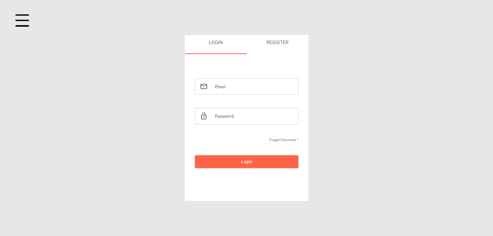
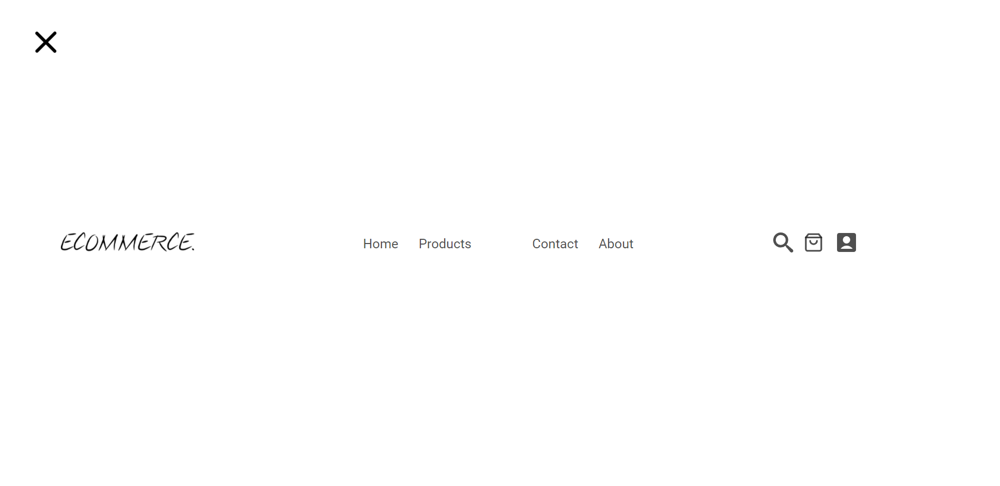
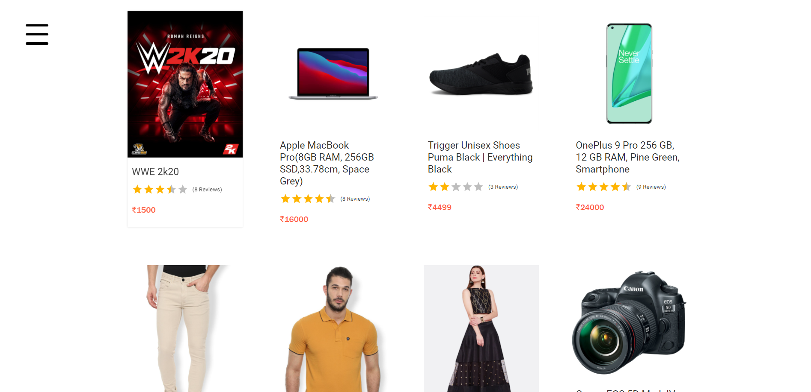
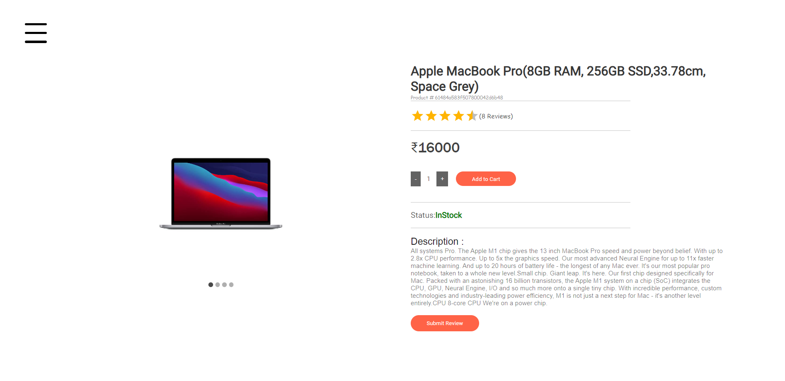

# Ecommerce-App

This is a MERN stack <b>Ecommerce App</b>. The frontend is based on `ReactJS` and the backend is built on top of `ExpressJS`. The database used in this project is `MongoDB`.

## How to run this web-app?

- Install all the dependencies of frontend as well as backend.

- Fill the required information in `./backend/config/config.env.example`. (Note: Make sure to use <b>PORT 4000</b> as your backend PORT.)

- Rename the file to `config.env`.

- Start the backend server using `npm start` command.

- In another terminal, Start the frontend using `npm start` command in `./frontend` directory.

- Open `localhost:3000` in your browser.

## Screenshots

